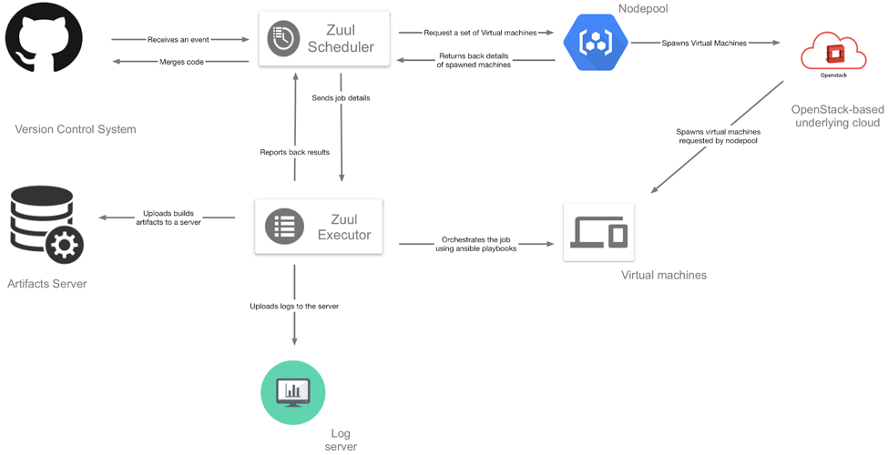

Overview
========

Workflow
--------

1. A review on Gerrit instance is created.
2. Zuul Scheduler listens to event stream from Gerrit and creates node creation request for NodePool.
3. NodePool spawns a slave VM(s) needed to run a job and returns it’s details to Zuul. Uses OpenStack as a provider cloud.
4. Zuul Executor runs the job on the slave VM(s).
5. Artifacts are uploaded to Docker Registry and YUM repository.
6. Logs and Ansible Run Analyzer (ARA) report get uploaded to the log server later to be available via http.
7. Job results are posted to Gerrit and Verified vote is casting accordingly to the result.
8. The review receives Code-Review +2 vote.
9. Review gets approved (Approved +1 vote).
10. After all voting requirements are met, Zuul automatically submits the change for merge and Gerrit merges it.

