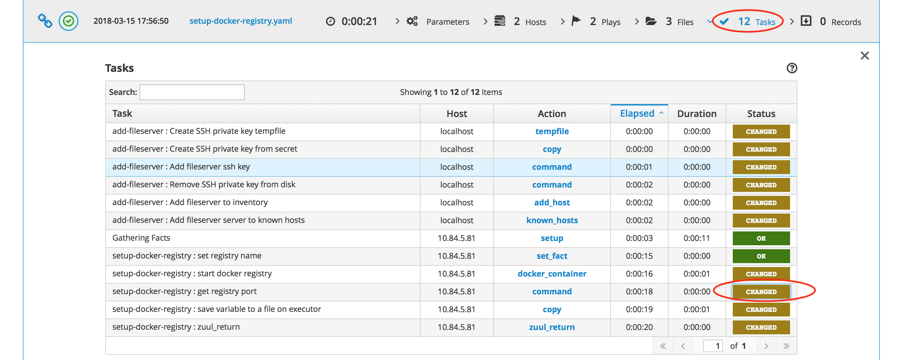
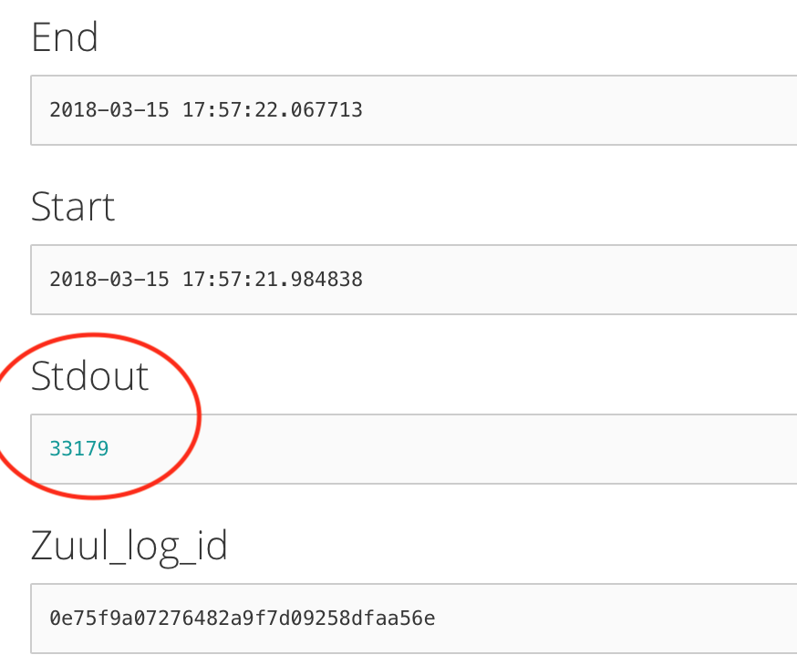

Artifacts
=========

For every review verified by Zuulv3, there are artifacts available to download from the CI network. 

While we're in the process of making them public, we upload containers to `DockerHub <https://hub.docker.com/r/opencontrailnightly/>`_ every 24 hours. For more information, please see :doc:`Nightly Builds <nightly>` page.

Retention
---------
TBD

Packages
--------
Packages are available at `CI repository <http://ci-repo.englab.juniper.net/pulp/repos/>`_. 

Every review creates a separate directory in format ``$review_number-$patchset_number``, so for review ``1337`` with patchset ``3``, full repository url will be ``http://ci-repo.englab.juniper.net/pulp/repos/1337-3``. All repositories include ``Packages`` directory with smaller directories listing packages alphabetically.

You can also use our repository as a direct source for your installation by pasting following content into ``/etc/yum.repos.d/contrail.repo``:
::

   [opencontrail]
   name=opencontrail
   baseurl=http://ci-repo.englab.juniper.net/pulp/repos/37779-10/
   enabled=1
   gpgcheck=0

Nightly
~~~~~~~
Nightly builds create directores in ``$branch-$build_number`` format and are stored in the same place as the rest of the packages.

Containers
----------
We host the containers on the same server we host the packages - CI repository. However, every review sets up a separate docker registry on custom port.

To verify what post was used for your review, go to the logs for ``contrail-vnc-build-containers-centos74`` job and then ``ara`` directory. There'll be a playbook called ``setup-docker-registry.yaml`` which contains tasks ``setup-docker-registry : get registry port``. Click on ``CHANGED`` next to a job name to see Ansible task output.

``Stdout`` field contains a port number for the dynamic Docker registry used for
the review.

When you combine ci-repo URL with port from ARA, your full url should look like
``ci-repo.englab.juniper.net:1337``. To verify the contents of the registry,
append ``/v2/_catalog`` and use ``curl`` or web browser to send API request and
see the contents of the registry.

**Note**: our Docker registries doesn't use SSL, so you need to configure it as
*insecure registry*. Please take a look `here
<https://docs.docker.com/registry/insecure/>`_ for instructions.
